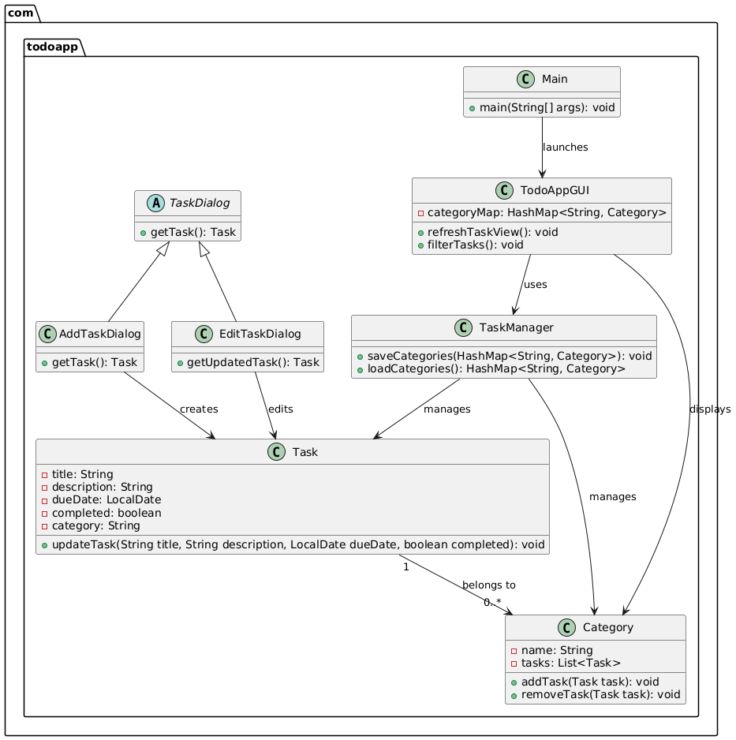
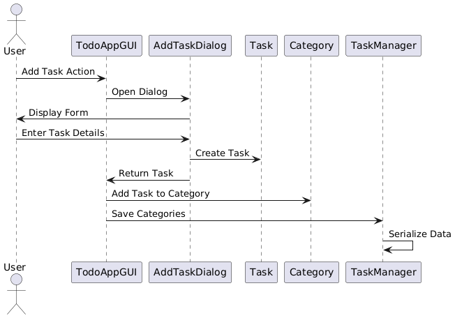
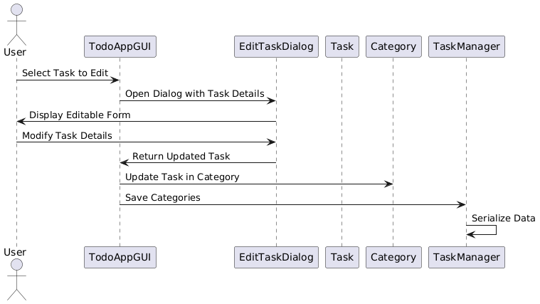
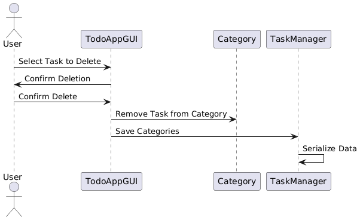
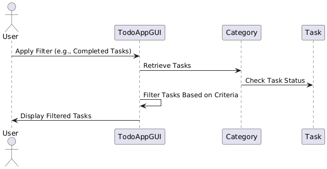
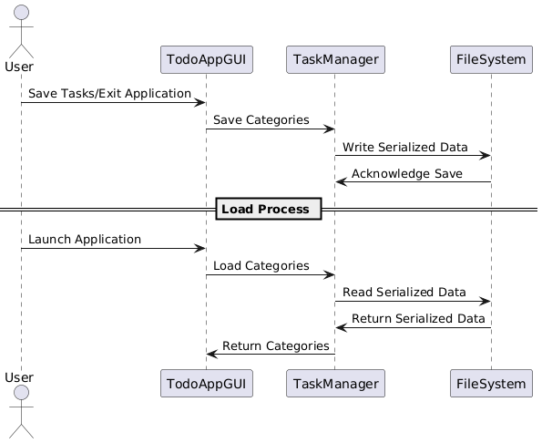
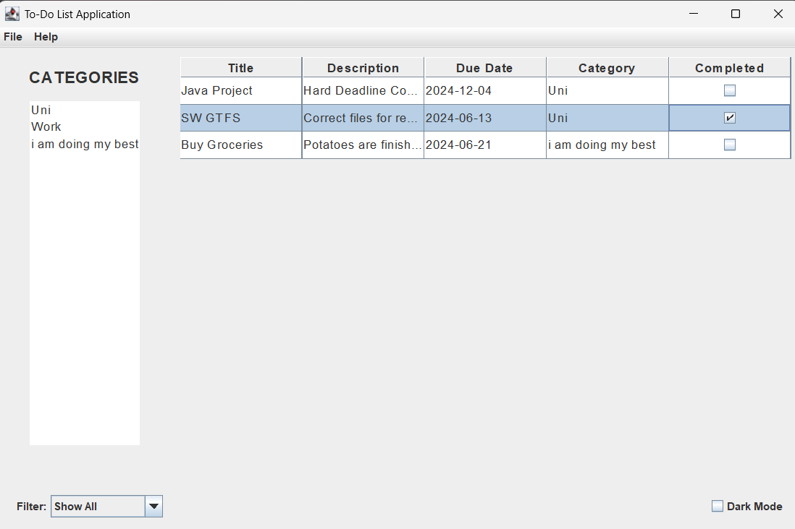
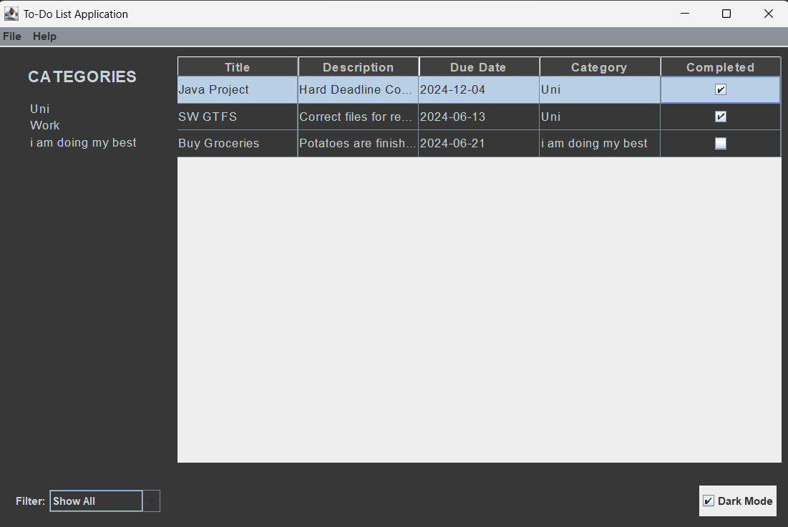

# To-Do List Application

## Overview

The **To-Do List Application** is a Java-based desktop task management system designed to help users organize and track their daily tasks efficiently. With a clean Swing-based graphical interface, robust functionality for task management, and data persistence through serialization, this project showcases the application of core Java concepts and design patterns.

---

## Features

- **Task Management**:
  - Add, edit, delete, and mark tasks as completed.
  - Categorize tasks and manage categories.
  - Set due dates and priorities for tasks.

- **Task Filtering and Sorting**:
  - Filter tasks based on completion status or category.
  - Sort tasks by title, due date, or priority.

- **Dark Mode**:
  - Switch between light and dark themes for improved user experience.

- **Data Persistence**:
  - Save and load tasks using Java serialization.

- **Statistics and Reporting** (Optional Enhancements):
  - Potential to expand with task statistics and progress tracking.

---

## Project Structure

```plaintext
TodoListApp/
├── src/
│   ├── main/
│   │   ├── java/
│   │   │   └── com/
│   │   │       └── todoapp/
│   │   │            ├── Category.java 
│   │   │            ├── Task.java 
│   │   │            ├── TaskManager.java 
│   │   │            ├── AddTaskDialog.java 
│   │   │            ├── EditTaskDialog.java 
│   │   │            ├── TodoAppGUI.java 
│   │   │            ├── Main.java 
│   │   ├── resources/
│   │       └── icons/
│   │           ├── add.png
│   │           ├── edit.png
│   │           ├── delete.png
│   │           ├── categories.png
│   │           ├── info.png
├── src/
│   ├── test/
│   │   ├── java/
│   │   │   └── com/
│   │   │       └── todoapp/
│   │   │            └── test/
│   │   │                ├── TaskTest.java
│   │   │                ├── SortingAndFilteringTest.java
│   │   │                ├── TaskManagerTest.java
├── pom.xml
└── .gitignore
```

## Software and Tools Requirements

### Development Environment
- **IDE**: IntelliJ IDEA
- **Build Tool**: Apache Maven
- **Version Control**: Git
- **Programming Language**: Java 17 or higher

### Minimum System Requirements
- **Operating System**: Windows 10/11, macOS, or Linux
- **RAM**: 4 GB (8 GB recommended)
- **Processor**: Intel Core i3 or equivalent
- **Disk Space**: 500 MB free space

### Key Technologies
- Java Swing for GUI
- Java Serialization for data persistence
- Maven for dependency management
- JUnit for unit testing

```

## Setup Instructions

1. Verify Java installation:
   ```bash
   java -version
   ```
   Ensure it shows `Java 17` or higher.

2. Install Maven (if not already installed):
   ```bash
   mvn -version
   ```
   Ensure Maven is properly set up.

3. Clone the repository:
   ```bash
   git clone https://github.com/ibrahimify/TodoListApp.git
   ```

4. Navigate to the project directory:
   ```bash
   cd todolistapp
   ```

5. Build the project:
   ```bash
   mvn clean install
   ```

6. Run the application:
   ```bash
   java -cp target/classes com.todoapp.Main
   ```

---

## Documentation

### Class Diagram

The class diagram represents the Todo List Application's architecture, showcasing key components and their interactions:

- `Task` is the core entity representing individual tasks with properties like title, description, and due date.
- `Category` manages task groupings, allowing tasks to be organized.
- `TaskManager` handles data persistence, saving and loading categories.
- Dialog classes (`AddTaskDialog` and `EditTaskDialog`) manage task creation and modification.
- `TodoAppGUI` provides the user interface, integrating task and category management.
- `Main` class serves as the application's entry point.



### Sequence Diagrams

| Diagram Name        | Description                                   | Link                                                |
|---------------------|-----------------------------------------------|-----------------------------------------------------|
| Add Task            | Task creation flow.                          |     |
| Edit Task           | Task modification flow.                      |   |
| Delete Task         | Task deletion process.                       |  |
| Filter Tasks        | Filtering tasks based on criteria.           |  |
| Save and Load Tasks | Saving and loading tasks through persistence.|  |

---

## User Interface Screenshots

### Light Mode


### Dark Mode


---

## How to Run

1. Clone the repository:
   ```bash
   git clone https://github.com/ibrahimify/TodoListApp.git
   ```
2. Navigate to the project directory:
   ```bash
   cd todolistapp
   ```
3. Build the project using Maven:
   ```bash
   mvn clean install
   ```
4. Run the application:
   ```bash
   java -cp target/classes com.todoapp.Main
   ```

---

## Testing

Run the unit tests to validate the functionality:
```bash
mvn test
```

---

## Contributing

Contributions are welcome! Fork the repository and submit a pull request for review.
